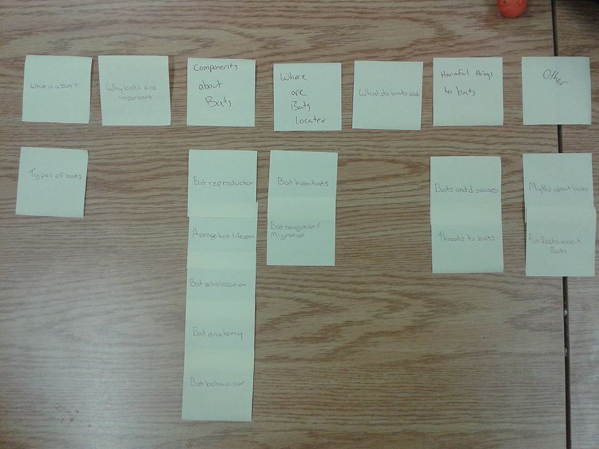
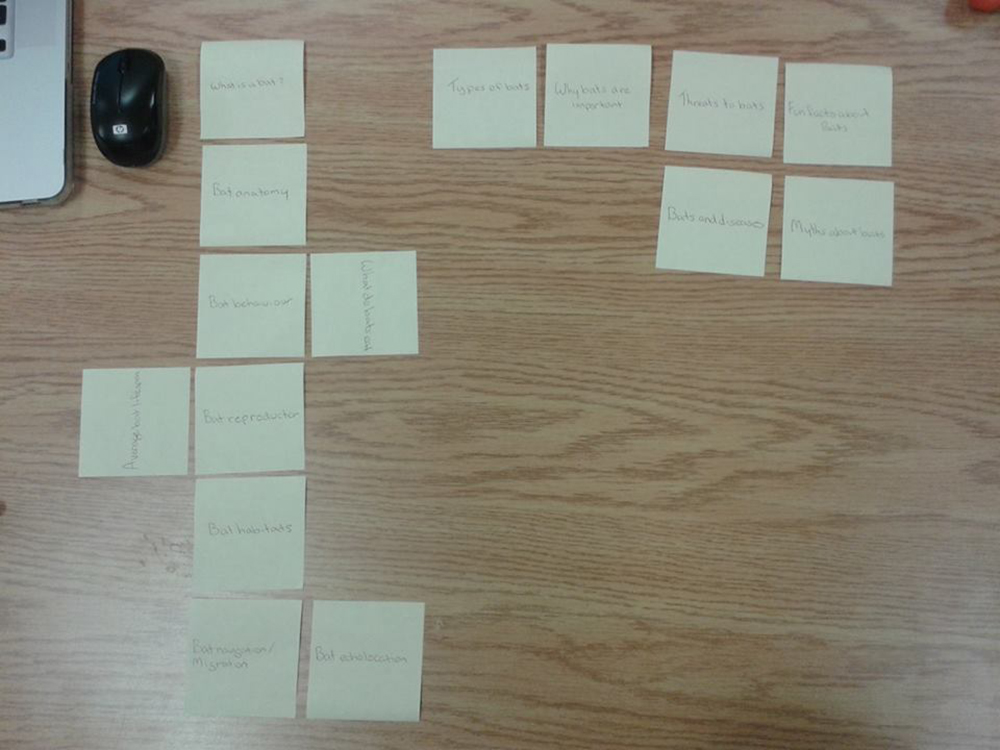

# Card sort report

The purpose of this card sort was to determine common navigation patterns and categories from the content of my large data-oriented website about bats.

## Specifics

The card sort was conducted by Jenny Richardson on 09/10/13 between the times of 3:00 and 6:00 with the following participants:

- Kayla Tuor
- Lisa Villeneuve

### Cards

15 cards were used covering a broad range of applicable content for the website. The following topics were used as cards:

1. What is a bat?
2. Types of Bats
3. Habitats
4. What do bats eat?
5. Bats and Diseases
6. Threats to Bats
7. Why Bats are Important
8. Bat Behaviour
9. Bat Navigation/Migration
10. Bat Anatomy
11. Average Bat Lifespan
12. Bat Echolocation
13. Bat Reproduction
14. Myths about Bats
15. Fun Bat Fats

## Card sort results

*Card sort 1 by Kayla Tuor*

*Card sort 2 by Lisa Villeneuve*

## Observations

- Did the participants have any common comments?
	-  The participants didn't have any comments.
- Did they have questions that stood out?
	- They didn't have any questions. 
- Did they struggle with certain articles or topics?
	- Kayla created her own categories to lay out the content in a more simple way to understand.
- Did they find common groupings? Or were the groupings completely different?
	- They were fairly similar, for the most part. Most of the similatiries were in the cards that had to do with the infomation about bats as a species and their anatomy.  
- Were some of the groupings completely unexpected?
 	- The groupings weren't very unexpected. Some of them were out of place in my opinion, but would still make sense.
- Were the results similar to your expectations?
	- I think Kayla did a good job of laying it out how I envisioned it, but the category titles she added in herself improved the groupings even more. I think Lisa had a bit of a different thought process of the groupings than I originally had, but there were still some simiarities in our thinking patterns. 
- How did you feel while watching them perform the task?
	- I felt like I didn't do the initial content properly and was worried that they wouldn't be able to find areas to put everything in a way that made sense. I think they both did a good job at categorizing my content though. 